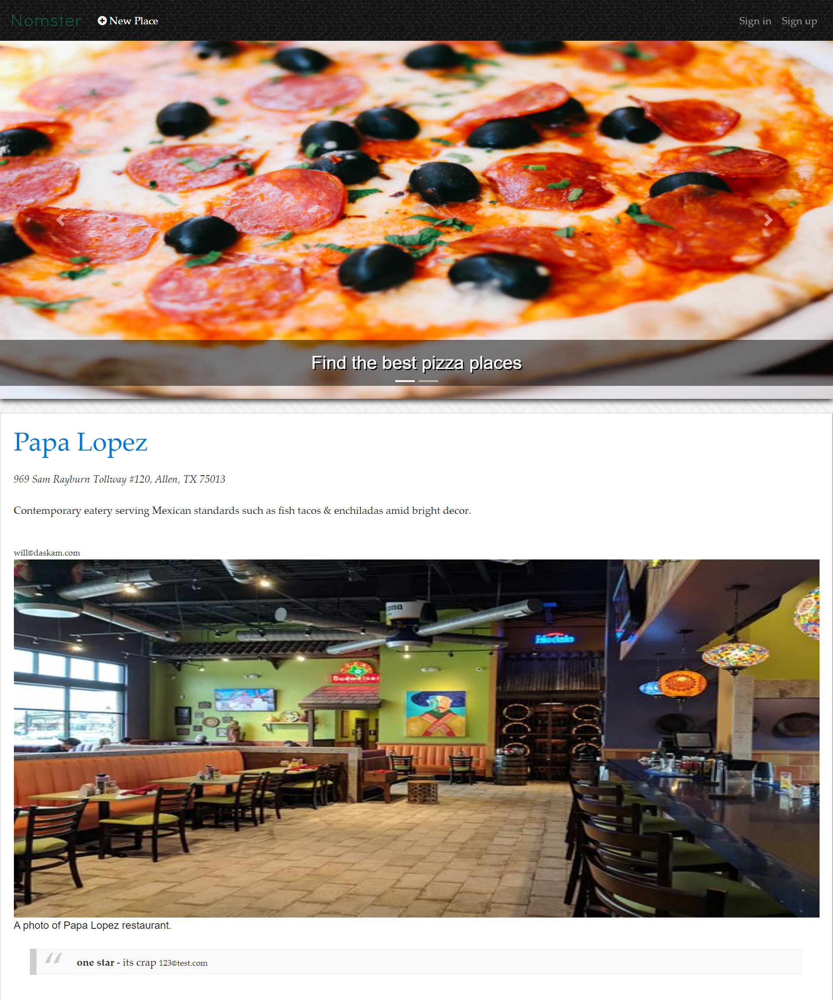
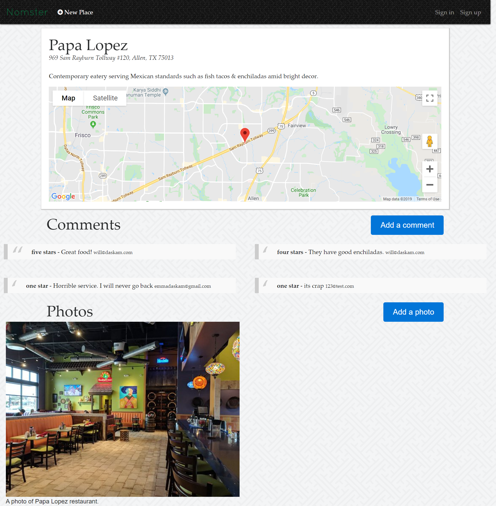

# Nomster

Restaurant review app similar to yelp that takes information about restaurants submitted by users, stores them in a database, and displays a list of the user submitted restaurants on the home page. Users can create an account to submit information about a restaurant, as well as click on the name of a restaurant to see more information about it, rate it, and comment on it. The app consists of the home page where the restaurants are displayed, a page listing information about the selected restaurant, and forms to create a new account, log in, and leave a comment and rating.

## Getting Started

These instructions will get you a copy of the project up and running on your local machine for development and testing purposes.

1. First clone the git repository, copy the url, and run 'git clone paste-url-here' in your coding environment. 

2. From here, you will need to run 'bundle install' and 'rake db:create' to install the necessary gems and create the initial databse respectively. Make sure to also run 'rake db:migrate' to ensure the database is up to date with all the migrations. 

3. Once the database is created, you should be able to get the project up and running on your local machine. Please note however, that some features of this app, such as the map functionality, will not work in the development environment.

4. In order to deploy your own copy of this project, you will need to create google api keys and store them in the 'config/application.yml' file in your project.

5. Lastly, you will need some way of storing user submitted images such as Amazon S3.

## Deployed Version of the App:

https://nomster-will-daskam.herokuapp.com/

## Built With

* [Bootstrap](https://getbootstrap.com/) - The web framework used

* Ruby version: 2.5.5

## Author

* **Will Daskam** 
